[TOC]


# 1 函数, 极限, 连续

## 1.1 函数


### 1.1.1函数定义

定义域+对应法则 => 值域

D + f = R

```
D : domain 自变量x取值范围
f : function 对应法则,给定x根据对应法则求出y
R : range
当D 与 f完全相同时两个函数表示同一函数
```

判断两个函数是否一致的话, 看2个函数定义域和对应法则是否完全一致

#### 求函数定义域

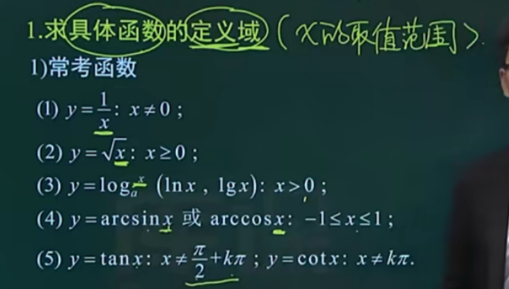

#### 抽象函数定义域

> 不具体告诉fx表达式

已知f[u(x)]定义域, 求f[v(x)]定义域

由x的范围求出u(x)定义域 再等于 v(x)定义域.

- 已知f(x)定义域(0,2] , 则f(x-1)的定义域为____(1,3]____

```
f(x1): 0< x <=2
f(x2): 0< x-1 <=2
	   1< x2 <=3
```

- 已知f(2x-1)定义域为[0,1],则f(x)定义域为________

```
f(2x-1): 已知定义域将端点值代入进去= [-1,1]
f(x):  D-f(x) = [-1,1]
```

- 已知f(x+1)定义域为(0,1],则f(x-1)定义域为_______

```
f(x+1)将端点值代入 得出值域(1,2]
f(x-1)的对应法则+值域(1,2] 反推出 定义域 (2,3]
```

#### 求函数的表示方法

- 已知fx的表达式,求f[u(x)]的表达式

已知f(x)=2x,则f(x-1)=__.

```
f(2x-1)
```

- 已知f[u(x)]表达式,求f(x)表达式

f(x+1)=x^2+2x+2则fx=_________

```
换元法
f(x+1)=x^2+2x+2
=x^2+2x+1+1
=(x+1)^2+1

f(x)=x^2+1
```

- 已知f[u(x)]表达式 , 求f[v(x)]表达式

已知f(x-1)=x^2-x,则 f(根x)=

```
f(x-1)=x^2-x
x−1=t
x=t+1
换元代入
=(t+1)^2−(t+1)
=t^2+2t+1−t−1
=t^2+t
将根x代入进
f(根x)=x+根号x
```


### 1.1.2 函数的性质

#### 1.1.1.1单调性

函数区间内的任意两点x1,x2

```
如果x1<x2,恒有f(x1)<f(x2),函数y=f(x)在该函数区间内单调递增
如果x1<x2,恒有f(x1)>f(x2),函数y=f(x)在该函数区间内单调递减

可导f'(x)>0 增函数
可导f'(x)<0 减函数
```

*单调性必须就区间而言*

```
定义判断
	1做差f(x1)-f(x2)
	2做商f(x1)/f(x2) (需同号)
求导

图像
我们通常使用函数求导来判断.
```


#### 1.1.1.2奇偶性

- f(x)定义域关于原点对称 //(x∈D,同有-x属于D)

1先看定义域. 偶函数关于y轴对称如y=x^2,也就是类似于 (-∞,+∞)

​	

就是偶函数图像的左(负部分)的关于x轴对称图形


```
如果D内任意点x恒有f(-x)=f(x),则称函数f(x)为D内的偶函数
如果D内任意点x恒有f(-x)=-f(x),则称函数f(x)为D内的奇函数

奇+奇=奇
奇*偶=奇
奇*奇=偶
偶+偶=偶
偶*偶=偶

奇+偶=飞机飞偶
可以把奇函数看作为负数
```

- 判断函数奇偶性一定要以定义域关于原点为前提,若定义域部关于原点对称函数必不是奇函数偶函数
- 以第一天的前提下, 函数图像关于y对称则是偶函数,函数关于原点则是奇函数(可旋转得到)

*例题*


#### 1.1.1.3有界性

对于y=f(x),若存在M>0,(m有长度)对于该区间任意x恒有|f(x)|<=M则成为有界函数  //-m <= f(x) <= M

有界意味着介于两条线之间,针对于y的值的有界,意味着上界+下届 

#### 1.1.1.4周期性

定义域D,存在T>0,对于任意的x属于D,有(x+-T)仍∈D,且恒f(x+-T)=f(x)则y=fx为周期函数,T是函数的fx的周期,最小正数T为最小正周期.

```
sinx,cosx T=2Π
tanx,cotx T=Π
计算方法:
	sin(2x),T= 2pi / 2 = pi
	cos(pi*x),T= 2pi / pi =2
	
```


### 1.1.3 反函数

```
反函数求出来后要写上定义域' y=ln(1+x), x∈(1,+∞)
```


```例如
y=2x+1
f(x): y=2x-1
f^-1(x): y-1=2x -> x=y-1 /2 -> y= x-1 /2
定义域x∈R

```


### 1.1.4 复合函数

y=f(u), u=g(x);

````
Rg => Df
内函数的值域就是外函数的定义域
```
sin x^2
外函数 sinx
内函数 x^2,
先算内函数再算外函数
```
sin^2 x
外函数是u^2
内函数sinx
````


### 1.1.5 基本初等函数

> 幂指对三角反三角这5类经过四则或复合形成一个表达式构成初等函数. (未涉及极限)

**公式**

幂,指

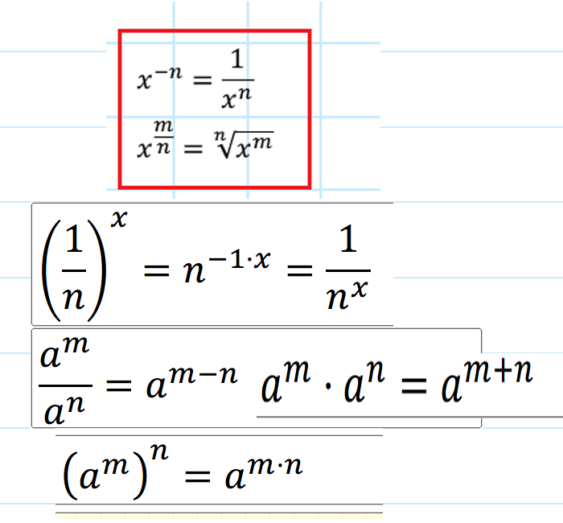


初等函数在其定义域内连续可导

#### 5.1 幂函数

>y=x^u
>Domain随着u变化,u为实数;
>Range(0,+∞)

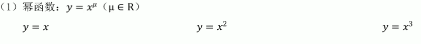

```
y=x的图象是一条斜线k斜率为45°
y=x^2是一条开口向上抛物线,左右关于y轴对称
y=x^3和x^2抛物线基本类似,左边图像由于立方可以为负所以关于x对称
```


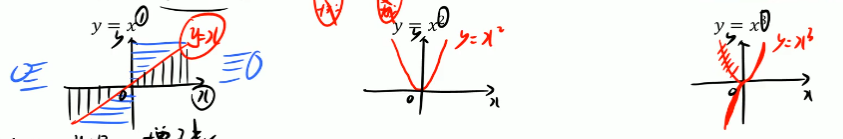


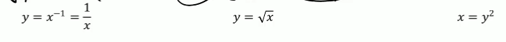


#### 5.2 指数函数

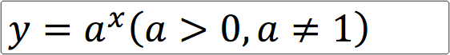

```
D(-∞,+∞)
R(0,+∞)
指数函数图像过(0,1). 任何数的x===1
									左(0<a<1), 右(a>1)
```


<hr>

#### 5.3 对数函数

*性质*

```
y=log,a,x(a>0,a!=1)
D(0,+∞)
R(无穷)
a>1:函数单调递增
0<a<1:函数单调递减

```


常用公式

```
lg==log,10;
ln==log,e; //(e≈2.718)

e^ ln(x) = x
```


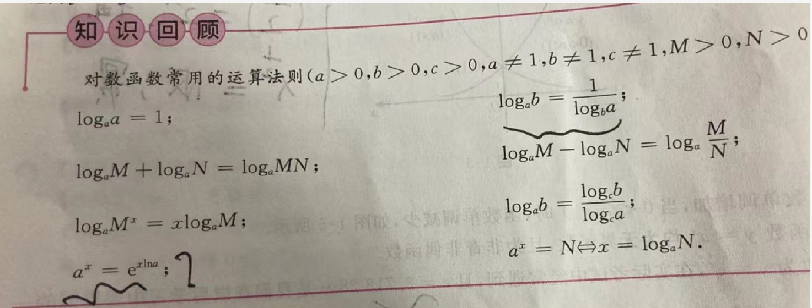


例

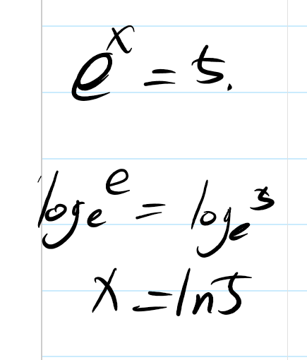


#### 5.4 三角函数

```
y=sinx,cosx
	D(∞),R[-1,1]
y=tanx
	D(x∈R,x!=pi/2 + K*pi),R(∞)
y=cosx
	D(x∈R, x !=k*PI)

```

##### 图像

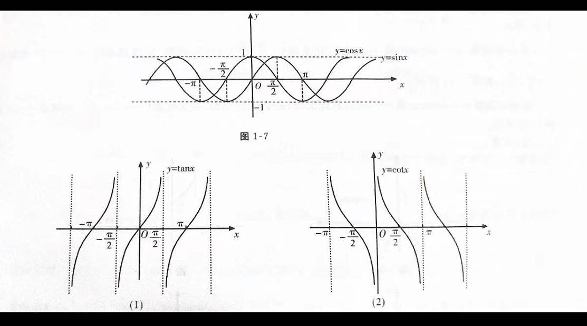

##### 性质

```
sinx是奇函数,cosx是偶函数. 有界函数[-1,1]他们又是周期函数,周期为2PI
tanx=sin/cos(奇/偶)=奇函数,cot=cos/sin=奇函数, 他们都是无界函数,以PI为周期
```

##### 公式

##### 特殊角函数值

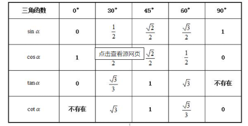

##### 恒等式

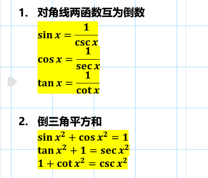

##### 诱导公式

```
什么是诱导公式:
	将非特殊三角函数值转换为特殊三角函数值
			sin⁡θ=(α+k⋅π/2)  (cos同理)
			奇变偶不变, 符号看象限
			k的值为奇/偶=>函数相应的要改变为sin, cos
			再根据原角度确定符号
			sin⁡〖〖210〗^0 〗=30+2⋅π/2=−sin⁡〖〖30〗^0 〗
			sin⁡〖〖290〗^0 〗=20+3⋅π/2=−cos⁡30
```


##### 倍角公式

```

```

#### 5.5 反三角

```
arcsinx
	y=sinx在区间[-PI/2 , PI/2]上的反函数, 
	D=[-1,1]
	R=[-PI/2 , PI/2]
arccosx
	y=cosx在区间[0,PI]上的反函数
	D[-1,1]
	R[0,PI]
arctanx
	y=tanx在区间(-PI/2,PI/2)上的反函数
	D=(-∞,+∞)
	R=(-PI/2,PI/2)
arccotx
	y=cotx在区间(0,PI)内反函数
  
```


**图像**


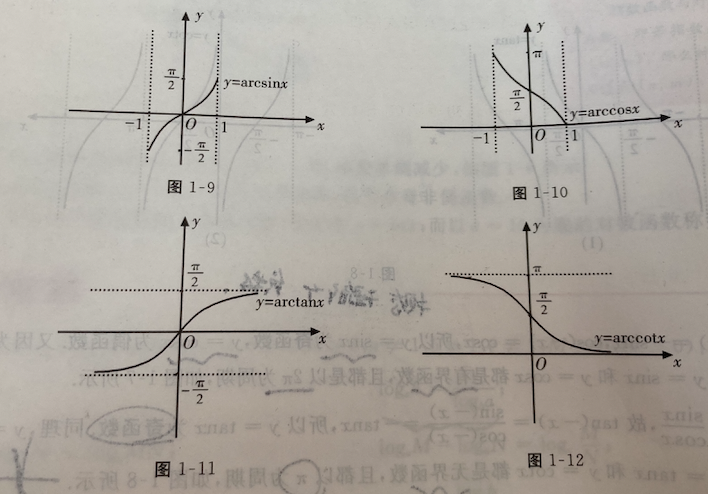


偶函数图像关于y对称,所以以上4都不是偶函数

(对于[函数定义域](https://baike.baidu.com/item/函数定义域/9900312)内的任意一个x，若f(-x)=-f(x)（[奇函数](https://baike.baidu.com/item/奇函数/107092)）和f(-x)=f(x)（[偶函数](https://baike.baidu.com/item/偶函数/6254807)）都不能成立，那么函数f(x)既不是奇函数又不是偶函数，称为非奇非偶函数。)

### 三角函数-普林斯顿微积分


首先抛弃掉关于度数的概念转变为弧度,并将常用的弧度进行转换在你脑中联系几次

pi = 180, pi/2 = 90, pi/3=60 pi/4=45, pi/6=30这些基本够了.

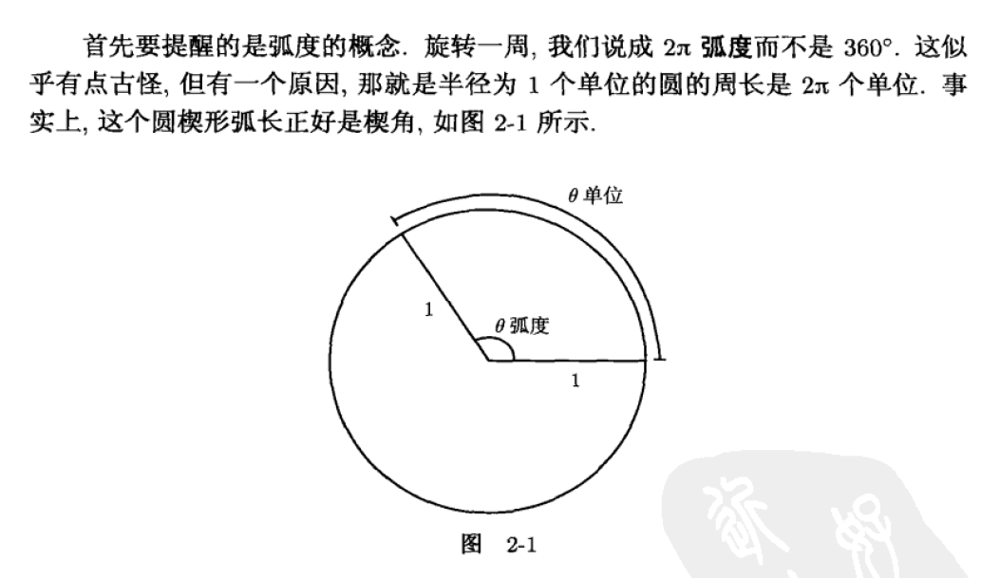


**一个基本的公式的话**


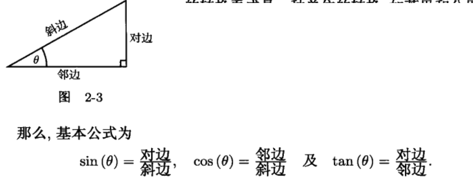


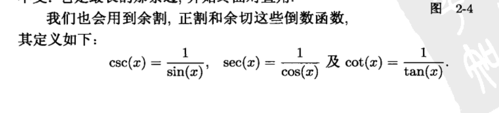

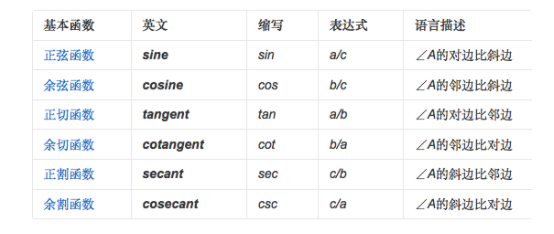

**三角函数值**


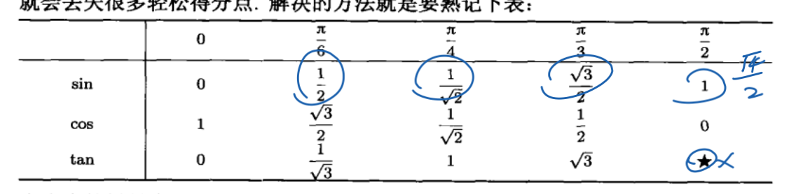


**函数在象限内的正负**

```
A一象限 all
S二象限 sin
T3⃣️象限 tan
C四象限 cos

在Kπ/2中如果K为偶数时函数名不变，若为奇数时函数名变为相反的函数名。正负号看原函数中α所在象限的正负号。
```

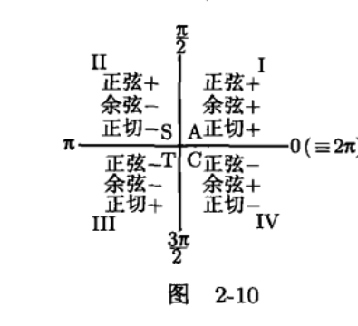


#### 三角函数图像

###### sin

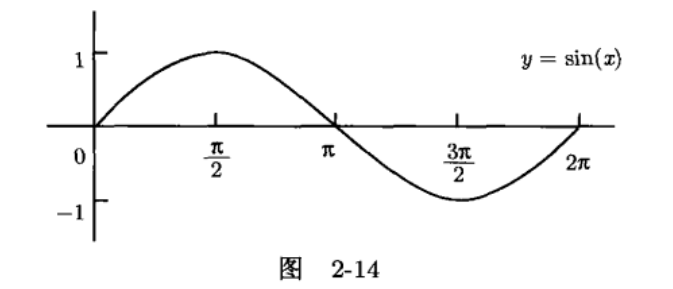


###### cos

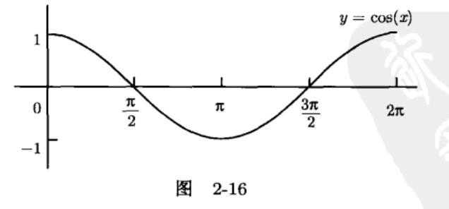

###### tan

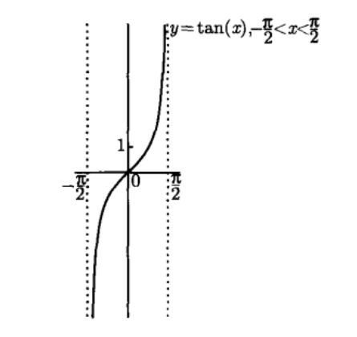

###### 其他

sec

csc

cot

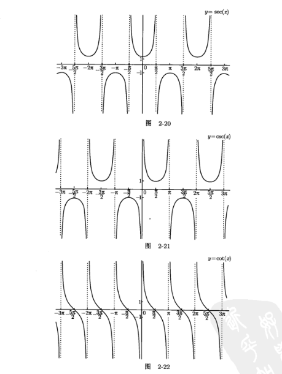

其中cosx是偶函数其他是奇函数


####  三角恒等式

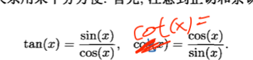

毕达哥拉斯

```
cos^2 x + sin^2 x =1
```

分开除以sin | cos将推广2个新的公式

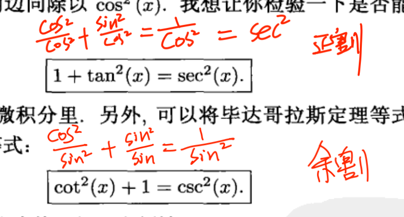


##### 和与倍公式

(⚠️符号)

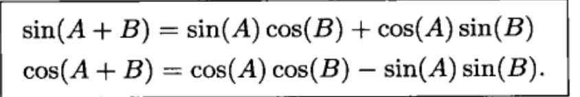

A+B 表示两个不同角和的三角函数值,那么如果AB相同得到就是倍角公式: (其中cos2a = cos^2a - sin^2a ).z

再利用毕达哥拉斯 sin^2+cos^2=1 >> sin^2 = 1-cos^2; cos^2  = 1-sin^2得到

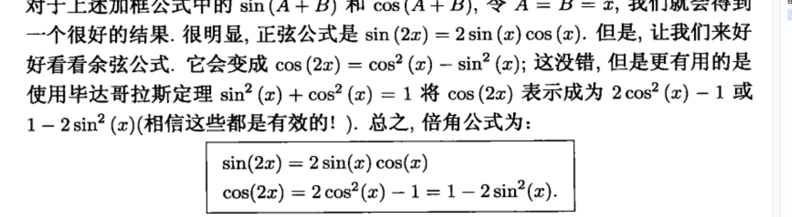  


### 1.1.6初等函数

> 幂指对三角反三角这5类经过四则或复合形成一个表达式构成初等函数


初等函数在其定义域内必连续且可导

### 1.1.7精选例题


